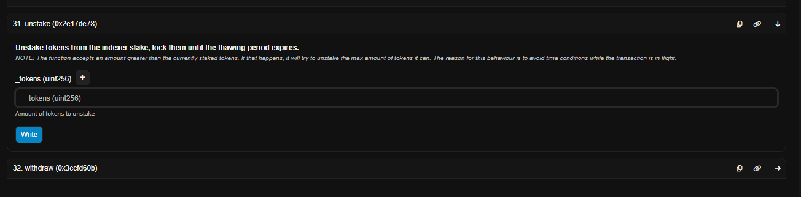

# Case Study: Unstaking Legacy GRT on Ethereum

## 🧠 Summary
In 2021, I delegated GRT on Ethereum using The Graph's original staking contract. In 2025, I manually traced the delegation and attempted to recover it. Even though I didn’t finalize the withdrawal (due to gas costs), I gained critical hands-on experience interacting with legacy on-chain infrastructure.

---

## 🔍 Delegation Details
- **Delegator Address:** `0x7de8028d51526ac58b71c6c2b3470bd32aa7f138`
- **Indexer Address:** `0xC60d0C8c74b5D3A33Ed51C007EbaE682490dE261`
- **Delegation Transaction:**  
  [View on Etherscan](https://etherscan.io/tx/0x4ab870ea83cab8075952a2ea905a7a050b6005fa4393e933d3f55dfbe8af560a)
- **Staking Proxy Contract:**  
  [`0xf55041e37e12cd407ad00ce2910b8269b01263b9`](https://etherscan.io/address/0xf55041e37e12cd407ad00ce2910b8269b01263b9#writeProxyContract)

---

## 🧠 Key Screenshots

### ▶️ The Contract Functions

### 📊 Delegation Log Event (Tokens & Shares)

### 🧾 Unstake Form with Gas Warning

---

## ⚙️ Process

1. **Searched my address** on Etherscan.
2. **Traced the delegation log** to the proxy contract.
3. Used the `unstake()` function with the token amount in **wei**:  
   `49227039014650000000`
4. Saw gas was **~$168** at 23 Gwei — **not worth claiming** <$10 of GRT.
5. Learned how smart contracts calculate shares vs tokens.

---

## ✅ Lessons Learned

- Navigated **legacy proxy contract** architecture.
- Practiced **manual token-to-wei** conversions.
- Gained hands-on experience with **Etherscan write functions**.
- Realized the importance of **Layer 2 scaling**.
- Understood the value of **contract abstraction like Chainlink’s model**.

---

## 🧰 Tags
#staking #grt #ethereum #etherscan #onchain #casestudy #gasfees #evm #legacy
